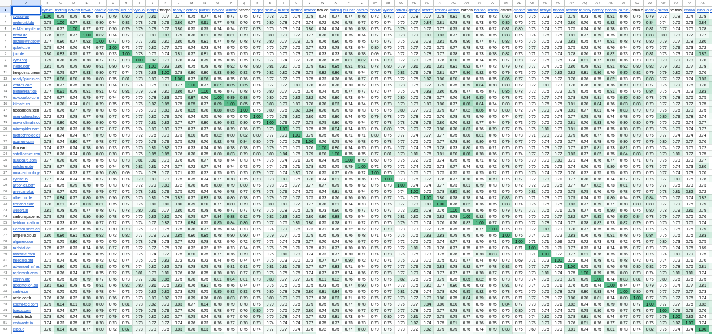

# Find similar startups

This is a demo of [startupradar.co](https://startupradar.co)'s API 
combined with OpenAI embeddings
to find similar startups.

The code works as follows:
1. load the list of startup domains in `domains.txt`
2. fetch descriptions of these startups with startupradar's API
3. create embeddings for all startups with OpenAI
4. compute cosine similarities between all pairs
5. output a similarity matrix as `similarity_matrix.csv`

The formatted output looks like this:



and the provided sample can be found in a [public Google Sheet](https://docs.google.com/spreadsheets/d/1WGsrq6eUC3bdFoV7pMVgbqqbyaBtjxl2cr_dMV0TVHA/).


## Installation and Usage

Install the dependencies into a virtual environment.

```commandline
pip install -r requirements.txt
```

Create a `config.py` file and add the credentials for startupradar and OpenAI:

```python
STARTUPRADAR_API_KEY = "your-key-here"

OPENAI_API_KEY = "your-key-here"
OPENAI_ENGINE = "text-similarity-davinci-001"
```

An API key for OpenAI can be created online.
Please note that embedding a lot of startups can result in significant charges.
Make sure to set budgets upfront!

Run with

```commandline
python cli.py run
```
